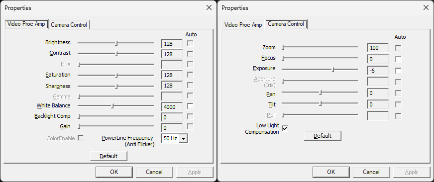

> [!NOTE]
> Reimplements the repo https://github.com/andrewj-t/wincamcfg as a .ps1 script. Created by proompting CoPilot a few times.
> copied from original repo with edits for ps1 and removing binary compilation steps.

> [!CAUTION]
> Script not tested for any usage other than setting PowerlineFrequency, no guarantees are provided about its support for other features. No warranties for any usage, this was created entirely by Copilot. Use at your own risk!!!

# wincamcfg.ps1

> A command-line script for managing webcam configuration on Windows

## The problem

Ever moved to a country with 50Hz powerline frequency and noticed your webcam footage looking like a disco strobe light? Windows defaults to 60Hz anti-flicker settings, which causes annoying flickering when your local power grid runs at 50Hz. While you *can* fix this manually in camera settings... doing it for multiple cameras or at scale is a pain.

That's where `wincamcfg.ps1` comes in.

## What it does

`wincamcfg.ps1` lets you read and write webcam properties from the command line. The original use case was fixing powerline-frequency flicker on cameras moved between 50Hz and 60Hz countries, but the same approach works for brightness, contrast, white balance, and the rest of the DirectShow property set.

It can set the same things as the native DirectShow camera-properties dialog:




## Usage

### List all cameras

See what cameras are connected to your system:

```powershell
wincamcfg.ps1 list
```

Example output:

```text
[0] Integrated Webcam
[1] Logitech HD Pro C920
```

### Get current settings

Check current property values for a specific camera:

```powershell
# Get all properties for camera 0
wincamcfg.ps1 get --camera 0

# Get all properties for all cameras
wincamcfg.ps1 get --camera all

# Output as JSON for scripting
wincamcfg.ps1 get --camera 0 --output json
```

### Fix powerline-frequency flickering

The main reason this tool exists! Set your cameras to match your local power grid:

```powershell
# Set camera 0 to 50Hz (for most of Europe, Asia, Africa, Australia, New Zealand)
wincamcfg.ps1 set --camera 0 --property PowerlineFrequency --value 50Hz

# Set camera 0 to 60Hz (for Americas, parts of Asia)
wincamcfg.ps1 set --camera 0 --property PowerlineFrequency --value 60Hz

# Set ALL cameras to 50Hz
wincamcfg.ps1 set --camera all --property PowerlineFrequency --value 50Hz
```

### Adjust other properties

Other settings you can change:

```powershell
# Adjust brightness
wincamcfg.ps1 set --camera 0 --property Brightness --value 128

# Adjust contrast
wincamcfg.ps1 set --camera 0 --property Contrast --value 150

# Enable auto white balance
wincamcfg.ps1 set --camera 0 --property WhiteBalance --value Auto

# Disable backlight compensation
wincamcfg.ps1 set --camera 0 --property BacklightCompensation --value Off
```

### Auto vs manual mode

Properties like `Exposure`, `Focus`, and `WhiteBalance` can run in either Auto or Manual mode. Pass `--value Auto` to switch the property into auto mode, or pass any numeric value to switch it into manual mode at that value.

```powershell
# Turn auto exposure ON
wincamcfg.ps1 set --camera 0 --property Exposure --value Auto

# Turn auto exposure OFF by setting an explicit manual value
# (use `get` to see the supported range and current value, e.g. -11..-1 on a C920)
wincamcfg.ps1 set --camera 0 --property Exposure --value -5

# Same idea for autofocus
wincamcfg.ps1 set --camera 0 --property Focus --value Auto    # autofocus on
wincamcfg.ps1 set --camera 0 --property Focus --value 0       # autofocus off, fixed focus
```

The current mode is shown in square brackets by `get`, e.g. `Exposure: -5 [Manual]` or `Exposure: -6 [Auto]`. Only properties that advertise Auto support will show a mode tag.

### Reset to defaults

Restore factory settings:

```powershell
# Reset a specific property to default
wincamcfg.ps1 set --camera 0 --property Brightness --default

# Reset ALL properties on a camera to defaults
wincamcfg.ps1 set --camera 0 --property all --default

# Reset ALL cameras to factory defaults
wincamcfg.ps1 set --camera all --property all --default
```

## Available properties

- `PowerlineFrequency` - Fix flickering (Disabled, 50Hz, 60Hz, Auto)
- `Brightness` - Adjust brightness levels
- `Contrast` - Adjust contrast levels
- `Hue` - Adjust colour hue
- `Saturation` - Adjust colour saturation
- `Sharpness` - Adjust image sharpness
- `Gamma` - Adjust gamma correction
- `WhiteBalance` - White balance (Auto or manual value)
- `BacklightCompensation` - Backlight compensation (On/Off)
- `Gain` - Gain/ISO control
- `colourEnable` - Enable/disable colour (On/Off)

Use `wincamcfg.ps1 get --camera 0` to see which properties your specific camera supports.

## Automation and scripting

Use `--output json` for machine-readable output:

```powershell
# PowerShell example: Configure all cameras on startup
wincamcfg.ps1 set --camera all --property PowerlineFrequency --value 50Hz --output json
```

Drop this into a startup script or GPO if you need every machine on a fleet to land on the same camera config.

## Requirements

- Windows (uses DirectShow APIs)
- Windows PowerShell (not tested with pwsh)

### Code signing

The release binary is **not code-signed**. Code-signing certificates aren't free and this is a side project. If your organization requires signed binaries, you can sign with `signtool` using your internal CA's certificate.

## License

MIT. See [LICENSE](LICENSE).

## Contributing

Bug reports and PRs welcome.
